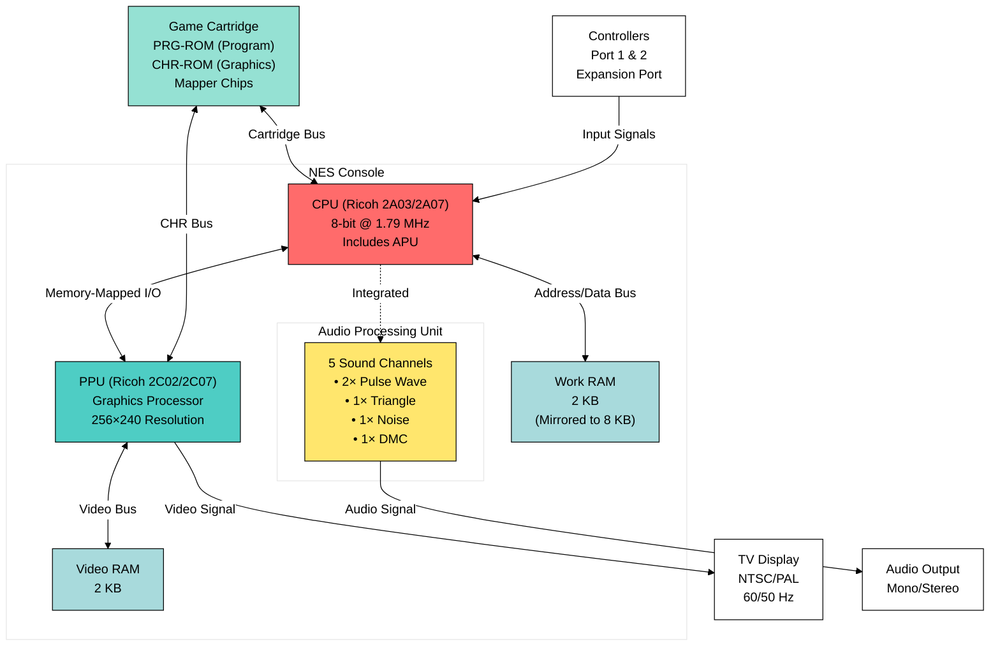

# The Nintendo Entertainment System: A Technical Deep Dive

## Introduction

The Nintendo Entertainment System (NES), known as the Famicom in Japan, stands as one of the most influential gaming consoles in history. Released in 1983 in Japan and 1985 in North America, the NES single-handedly revitalized the video game industry after the 1983 crash and established Nintendo as a household name. This 8-bit console introduced millions to iconic franchises and set design standards that persist in modern gaming.

With its distinctive gray and black aesthetic, the NES brought arcade-quality gaming into homes worldwide, selling over 61 million units globally. Beyond its commercial success, the NES's elegant hardware architecture and creative constraints inspired developers to push the boundaries of what was possible with limited resources.

## Basic Information

**Technical Specifications:**
- **Name:** Nintendo Entertainment System (NES) / Family Computer (Famicom)
- **Manufacturer:** Nintendo
- **Generation:** Third generation (8-bit era)
- **Release Dates:**
  - Japan (Famicom): July 15, 1983
  - North America: October 18, 1985
  - Europe: September 1, 1986
- **Discontinued:** 1995 (2003 in Japan)
- **Units Sold:** 61.91 million worldwide
- **Media:** ROM cartridge
- **Controller Ports:** 2 (NES), expandable to 4 with accessories

## Architecture Overview

The NES architecture represents a well-balanced design optimized for sprite-based 2D gaming. The system consists of several key components working in harmony:

### System Components

1. **Central Processing Unit (CPU):** Custom Ricoh 2A03 (NTSC) / 2A07 (PAL)
2. **Picture Processing Unit (PPU):** Ricoh 2C02 (NTSC) / 2C07 (PAL)
3. **Audio Processing Unit (APU):** Integrated within the CPU chip
4. **RAM:** 2 KB work RAM, 2 KB video RAM
5. **Cartridge Interface:** Expandable via mapper chips

### Memory Map

The NES uses a memory-mapped I/O architecture:
- **$0000-$07FF:** 2 KB internal RAM (mirrored up to $1FFF)
- **$2000-$2007:** PPU registers (mirrored up to $3FFF)
- **$4000-$4017:** APU and I/O registers
- **$4020-$FFFF:** Cartridge space (PRG-ROM, PRG-RAM, and mapper registers)

## CPU Structure

### Ricoh 2A03/2A07 Processor

The NES CPU is based on the MOS Technology 6502, one of the most popular 8-bit processors of the era. Ricoh's custom variant removes the 6502's decimal mode and integrates an Audio Processing Unit.

**Key Specifications:**
- **Clock Speed:** 1.79 MHz (NTSC) / 1.66 MHz (PAL)
- **Data Bus:** 8-bit
- **Address Bus:** 16-bit (64 KB addressable memory)
- **Registers:**
  - **A (Accumulator):** 8-bit general-purpose register
  - **X, Y (Index Registers):** 8-bit registers for indexing and counters
  - **S (Stack Pointer):** 8-bit stack pointer ($0100-$01FF)
  - **PC (Program Counter):** 16-bit instruction pointer
  - **P (Processor Status):** 8-bit flags register (N, V, -, B, D, I, Z, C)

**Instruction Set:**
- 56 official opcodes with multiple addressing modes
- 6-clock cycle interrupt handling
- Support for interrupts: IRQ, NMI, and RESET

**Integrated APU:**
The Audio Processing Unit within the 2A03 provides 5 sound channels:
- 2 pulse wave channels (square waves)
- 1 triangle wave channel
- 1 noise channel
- 1 delta modulation channel (DMC) for samples

The APU's simple but effective design allowed developers to create memorable soundtracks that define the 8-bit era's sonic identity.

## PPU Structure

### Ricoh 2C02/2C07 Picture Processing Unit

The PPU is the heart of the NES's graphics capabilities, handling all video output independently from the CPU. This separation allowed for smooth graphics without burdening the CPU.

**Display Specifications:**
- **Resolution:** 256×240 pixels (NTSC)
- **Color Palette:** 54 colors (from a hardware palette of 64)
- **Refresh Rate:** 60.0988 Hz (NTSC) / 50.0070 Hz (PAL)
- **Video RAM:** 2 KB internal, expandable via cartridge

**Graphics Capabilities:**

1. **Background Layers:**
   - 4 nametables (2 internal, 2 typically on cartridge)
   - 32×30 tile grid per nametable
   - 8×8 pixel tiles
   - 4 colors per tile from 4 available palettes

2. **Sprite System:**
   - 64 sprites total (Object Attribute Memory - OAM)
   - 8 sprites maximum per scanline
   - 8×8 or 8×16 pixel sprite sizes
   - 3 colors + transparency per sprite
   - Hardware sprite priority and flipping

3. **Scrolling:**
   - Hardware smooth scrolling support
   - Multiple scrolling regions possible with careful timing
   - Enabled techniques like parallax scrolling and split-screen effects

**Pattern Tables:**
The PPU stores tile graphics in pattern tables (CHR-ROM/RAM):
- 2 pattern tables of 256 tiles each
- Each tile is 8×8 pixels with 2-bit color depth
- 16 bytes per tile (2 bitplanes)

**Rendering Process:**
The PPU renders one scanline at a time, fetching tile data and sprite information in a precise sequence. Developers could manipulate PPU registers mid-frame to create sophisticated visual effects, though this required careful timing to avoid glitches.

## Classical Games List

The NES's library boasts some of gaming's most beloved titles. Here's a curated list of classics that defined the platform:

### Platformers

**Super Mario Bros. (1985)**
The game that defined the platformer genre. Players control Mario through the Mushroom Kingdom to rescue Princess Peach from Bowser. Its tight controls, creative level design, and memorable power-ups created the template for platformers that persists today. Sold over 40 million copies, making it one of the best-selling games of all time.

**Super Mario Bros. 3 (1988)**
The pinnacle of NES platforming, introducing the overworld map, diverse power-ups (including the iconic Raccoon Suit), and incredibly varied level design. Its technical achievements pushed the NES hardware to new heights, featuring detailed graphics and smooth scrolling.

**Mega Man 2 (1988)**
Refined the challenging formula of the original with better level design and memorable Robot Masters. Players choose which stages to tackle, gaining weapons from defeated bosses. Known for its excellent music and "difficult but fair" gameplay philosophy.

**Castlevania (1986)**
Gothic action-platformer where players control Simon Belmont battling through Dracula's castle. Featured precise whip mechanics, subweapons, and atmospheric design that launched a legendary franchise.

**Contra (1988)**
Intense run-and-gun action requiring pixel-perfect precision. Famous for its two-player co-op gameplay, diverse weaponry, and the legendary Konami Code. Established the template for action shooters on consoles.

### Action-Adventure

**The Legend of Zelda (1986)**
Revolutionary open-world adventure that gave players unprecedented freedom. Featured an overworld to explore, dungeons to conquer, and items to discover. The gold cartridge included battery-backed save functionality, allowing players to continue their quest across multiple sessions.

**Zelda II: The Adventure of Link (1987)**
Controversial sequel that shifted to side-scrolling action with RPG elements. Despite dividing fans, it introduced mechanics that would influence later entries, including the magic meter and the character of Dark Link.

**Metroid (1986)**
Atmospheric sci-fi adventure featuring bounty hunter Samus Aran exploring the planet Zebes. Non-linear exploration, permanent power-ups, and an interconnected world created the "Metroidvania" genre. The revelation that Samus was female became one of gaming's most famous plot twists.

### Role-Playing Games

**Final Fantasy (1987)**
Square's ambitious RPG that saved the company from bankruptcy. Features a party of four customizable Light Warriors on a quest to restore balance to the world. Introduced job classes, turn-based combat, and the series' signature crystals and Chocobos.

**Dragon Warrior (Dragon Quest) (1986)**
The game that popularized JRPGs, featuring turn-based combat, experience points, and a hero's quest to defeat the Dragonlord. Its simplicity made RPGs accessible to console audiences. Bundled with Nintendo Power subscriptions in North America to boost awareness.

**Final Fantasy III (1990)**
Japan-exclusive until later ports, featuring a refined job system and four orphans on an epic quest. Showcased advanced graphics for the NES and complex storytelling that pushed the platform's capabilities.

### Puzzle & Strategy

**Tetris (1989)**
The perfect puzzle game. Falling tetromino blocks must be arranged to clear lines in increasingly fast gameplay. Simple to learn but impossible to master, Tetris became a cultural phenomenon and demonstrated that gameplay trumps graphics.

**Dr. Mario (1990)**
Nintendo's answer to competitive puzzle games, where players eliminate viruses by matching colored capsules. Combined Tetris-style falling pieces with color-matching mechanics, creating a highly addictive experience.

### Sports & Racing

**Excitebike (1984)**
Motocross racing game with a track editor, allowing players to create and share custom courses. Featured physics-based jumping and a temperature mechanic requiring strategic turbo management.

**Punch-Out!! (1987)**
Boxing game featuring colorful opponents with distinct patterns and personalities. Success required studying opponents, learning their tells, and striking with precise timing. Little Mac's journey through the ranks became legendary.

**Tecmo Bowl (1989)**
Fast-paced American football that prioritized fun over simulation. Featured real NFL teams (later) and became famous for Bo Jackson's unstoppable running ability.

### Shoot 'Em Ups

**Gradius (1986)**
Side-scrolling space shooter with the innovative power-up bar system, allowing players to choose their upgrades. Known for challenging gameplay and the iconic Vic Viper ship.

**Life Force (Salamander) (1987)**
Konami's vertically and horizontally scrolling shooter with biological-themed enemies. Featured two-player simultaneous co-op and the memorable "crawling through a giant creature" aesthetic.

### Action & Beat 'Em Ups

**Double Dragon II: The Revenge (1989)**
Refined beat 'em up gameplay with new moves, better graphics, and more responsive controls than the original. Billy and Jimmy Lee's quest for revenge defined cooperative arcade action on the NES.

**Ninja Gaiden (1988)**
Blazingly fast action-platformer with cinematic cutscenes that advanced storytelling in games. Notorious difficulty, especially the final stages, created intense but rewarding gameplay.

**River City Ransom (1989)**
Unique blend of beat 'em up combat, RPG statistics, and open-world exploration. Players could shop for food to increase stats, creating a progression system rare in action games.

### Unique & Innovative

**Duck Hunt (1984)**
Light gun shooter bundled with the NES Zapper, where players shoot ducks and clay pigeons. The laughing dog became an iconic character. Demonstrated Nintendo's commitment to innovative peripherals.

**Balloon Fight (1985)**
Original arcade-style action game where players pop opponents' balloons while protecting their own. Simple yet addictive multiplayer competition.

**Kid Icarus (1986)**
Vertically scrolling action-platformer mixing Greek mythology with Nintendo's charm. Featured shops, permanent upgrades, and multiple endings based on performance.

## Conclusion

The Nintendo Entertainment System's legacy extends far beyond its impressive technical specifications. By combining a well-designed architecture with creative constraints, the NES forced developers to innovate, resulting in some of gaming's most creative and memorable experiences.

The CPU and PPU's separation of duties created a balanced system optimized for sprite-based games, while mapper chips in cartridges allowed developers to expand the console's capabilities over its lifespan. This forward-thinking design meant that games released in 1990 could far exceed what seemed possible in 1985.

More importantly, the NES established franchises—Mario, Zelda, Metroid, Final Fantasy, Mega Man, and countless others—that remain cultural touchstones decades later. It proved that video games could be a legitimate entertainment medium with artistic merit and emotional resonance.

The technical constraints of 2 KB RAM and a 1.79 MHz processor didn't limit creativity; they channeled it. Every sprite, every tile, every sound channel had to be carefully considered, resulting in focused, polished experiences. Modern developers still study NES games to understand fundamental game design principles.

Today, the NES remains relevant through retro gaming communities, speedrunning, homebrew development, and its influence on indie games embracing "8-bit" aesthetics. The console that saved gaming continues to inspire new generations, proving that timeless design transcends technological limitations.

The NES didn't just entertain—it transformed gaming into the industry we know today. Its architectural elegance, combined with Nintendo's software excellence, created a golden age whose impact resonates through every console generation that followed.

---

*"Now you're playing with power!" - Nintendo's iconic slogan embodied the NES experience: pure, accessible, unforgettable gaming.*
