# The IBM PC Architecture: A Deep Dive into the 8088-Based System

## Introduction

On August 12, 1981, IBM introduced the IBM Personal Computer (model 5150), a machine that would revolutionize the computing industry and establish the foundation for the modern PC architecture we use today. At the heart of this groundbreaking computer was the Intel 8088 microprocessor, a 16-bit CPU with an 8-bit external data bus that struck a perfect balance between performance and affordability.

This comprehensive guide explores the architecture of the original IBM PC, examining its components in detail, from the 8088 processor to common peripherals. Whether you're a computer enthusiast, student, or professional interested in the foundations of modern computing, this deep dive will provide valuable insights into the design decisions and engineering that shaped personal computing.

## Historical Context

### Why the 8088?

IBM's choice of the Intel 8088 over the 8086 was a strategic decision driven by several factors:

- **Cost Efficiency**: The 8-bit data bus allowed the use of cheaper 8-bit support chips and memory components
- **Market Timing**: Leveraged existing 8-bit peripheral ecosystem
- **Performance**: Offered 16-bit internal processing with acceptable performance for business applications
- **Compatibility**: Shared the same instruction set as the 8086, ensuring software portability

### Market Impact

The IBM PC wasn't the first personal computer, but it became the most influential:

- **Open Architecture**: IBM published complete technical specifications, enabling third-party development
- **Business Credibility**: IBM's reputation legitimized personal computers in corporate environments
- **Software Ecosystem**: Spawned a vast software industry, led by Microsoft DOS
- **Industry Standard**: Created the "IBM PC compatible" market that dominates to this day

## The Intel 8088 Processor

### Architecture Overview

The Intel 8088 is a 16-bit microprocessor with several distinctive characteristics:

**Key Specifications:**
- **Process Technology**: HMOS (High-density Metal-Oxide Semiconductor)
- **Transistor Count**: Approximately 29,000 transistors
- **Clock Speed**: 4.77 MHz in the original IBM PC
- **Data Bus**: 8-bit external (16-bit internal)
- **Address Bus**: 20-bit (1 MB addressable memory)
- **Registers**: Eight 16-bit general-purpose registers
- **Instruction Queue**: 4-byte prefetch queue
- **Package**: 40-pin DIP (Dual In-line Package)

### Internal Architecture

The 8088 processor is internally divided into two independent functional units that work in parallel: the **Bus Interface Unit (BIU)** and the **Execution Unit (EU)**. This design allows instruction fetching and execution to overlap, improving overall performance.

#### Block Diagram: 8088 Internal Architecture

```mermaid
%%{init: {'theme':'base', 'themeVariables': { 'primaryColor':'#0277bd','primaryTextColor':'#fff','primaryBorderColor':'#01579b','lineColor':'#424242','secondaryColor':'#d84315','tertiaryColor':'#6a1b9a','clusterBkg':'#fafafa','clusterBorder':'#212121','edgeLabelBackground':'#ffffff00','titleColor':'#000'},'flowchart':{'curve':'linear'}}}%%
flowchart TB
    subgraph CPU["Intel 8088 Microprocessor - 4.77 MHz"]
        subgraph BIU["Bus Interface Unit (BIU)"]
            Queue["Instruction Queue<br/>(4-byte FIFO)<br/>┌───┬───┬───┬───┐<br/>│ Q │ Q │ Q │ Q │<br/>└───┴───┴───┴───┘"]

            SegRegs["Segment Registers<br/>━━━━━━━━━━━━━━<br/>CS - Code Segment<br/>DS - Data Segment<br/>SS - Stack Segment<br/>ES - Extra Segment"]

            IP["Instruction Pointer<br/>(IP - 16-bit)"]

            AddrGen["Address Generation<br/>━━━━━━━━━━━━━━<br/>(Segment << 4) + Offset<br/>↓<br/>20-bit Physical Address"]

            BusBuffer["8-bit Data Bus Buffer<br/>━━━━━━━━━━━━━━"]

            Queue ---|c1| SegRegs
            SegRegs ---|c2| IP
            IP ---|c3| AddrGen
            AddrGen ---|c4| BusBuffer
        end

        subgraph EU["Execution Unit (EU)"]
            GenRegs["General Purpose Registers<br/>━━━━━━━━━━━━━━━━━━━<br/>AX: │ AH │ AL │ Accumulator<br/>BX: │ BH │ BL │ Base<br/>CX: │ CH │ CL │ Count<br/>DX: │ DH │ DL │ Data"]

            PtrRegs["Pointer & Index Registers<br/>━━━━━━━━━━━━━━━━━━━<br/>SP - Stack Pointer<br/>BP - Base Pointer<br/>SI - Source Index<br/>DI - Destination Index"]

            ALU["Arithmetic Logic Unit<br/>━━━━━━━━━━━━━━━━<br/>• Add/Subtract<br/>• Logic Operations<br/>• Shift/Rotate<br/>• Multiply/Divide"]

            FLAGS["FLAGS Register<br/>━━━━━━━━━━━━<br/>OF - Overflow<br/>DF - Direction<br/>IF - Interrupt<br/>TF - Trap<br/>SF - Sign<br/>ZF - Zero<br/>AF - Aux Carry<br/>PF - Parity<br/>CF - Carry"]

            Control["Control Unit<br/>━━━━━━━━━━━<br/>• Instruction Decoder<br/>• Microcode Engine<br/>• Timing & Control"]

            GenRegs ---|d1| ALU
            PtrRegs ---|d2| ALU
            ALU ---|d3| FLAGS
            FLAGS ---|c5| Control
        end

        subgraph ExtBus["External Bus Interface"]
            DataBus["8-bit Data Bus<br/>(D0-D7)"]
            AddrBus["20-bit Address Bus<br/>(A0-A19)<br/>1 MB Address Space"]
            CtrlSig["Control Signals<br/>RD, WR, M/IO, etc."]
        end

        Queue ---|c6 Instruction Flow| Control
        Control ---|c7 Data Requests| Queue
        BusBuffer ---|d4| DataBus
        AddrGen ---|d5| AddrBus
        BIU ---|c8| CtrlSig

        GenRegs ---|d6 Internal 16-bit Data Path| Queue
        PtrRegs ---|d7 Internal 16-bit Data Path| SegRegs
    end

    Memory["External Memory<br/>(RAM/ROM)"]
    IO["I/O Devices<br/>(Peripherals)"]

    DataBus <---|d8| Memory
    DataBus <---|d9| IO
    AddrBus ---|d10| Memory
    AddrBus ---|d11| IO
    CtrlSig ---|c9| Memory
    CtrlSig ---|c10| IO

    %% Data Path Styling (Green - thicker lines)
    linkStyle 4,5,6,10,11,13,14,15,16,17,18 stroke:#2e7d32,stroke-width:4px

    %% Control Path Styling (Orange - medium lines)
    linkStyle 0,1,2,3,7,8,9,12,19,20 stroke:#ff6f00,stroke-width:3px

    style BIU fill:#e1f5ff,stroke:#01579b,stroke-width:3px,color:#01579b
    style EU fill:#fbe9e7,stroke:#bf360c,stroke-width:3px,color:#bf360c
    style ExtBus fill:#f3e5f5,stroke:#4a148c,stroke-width:3px,color:#4a148c
    style CPU fill:#fafafa,stroke:#212121,stroke-width:4px,color:#000
    style Queue fill:#0288d1,stroke:#01579b,stroke-width:2px,color:#fff
    style SegRegs fill:#0288d1,stroke:#01579b,stroke-width:2px,color:#fff
    style IP fill:#0288d1,stroke:#01579b,stroke-width:2px,color:#fff
    style AddrGen fill:#0288d1,stroke:#01579b,stroke-width:2px,color:#fff
    style BusBuffer fill:#0288d1,stroke:#01579b,stroke-width:2px,color:#fff
    style GenRegs fill:#e64a19,stroke:#bf360c,stroke-width:2px,color:#fff
    style PtrRegs fill:#e64a19,stroke:#bf360c,stroke-width:2px,color:#fff
    style ALU fill:#e64a19,stroke:#bf360c,stroke-width:2px,color:#fff
    style FLAGS fill:#e64a19,stroke:#bf360c,stroke-width:2px,color:#fff
    style Control fill:#e64a19,stroke:#bf360c,stroke-width:2px,color:#fff
    style DataBus fill:#7b1fa2,stroke:#4a148c,stroke-width:2px,color:#fff
    style AddrBus fill:#7b1fa2,stroke:#4a148c,stroke-width:2px,color:#fff
    style CtrlSig fill:#7b1fa2,stroke:#4a148c,stroke-width:2px,color:#fff
    style Memory fill:#2e7d32,stroke:#1b5e20,stroke-width:2px,color:#fff
    style IO fill:#2e7d32,stroke:#1b5e20,stroke-width:2px,color:#fff
```



**Diagram Legend:**
- 🟢 **Green Lines (Thick)**: Data paths - actual data flow between components
- 🟠 **Orange Lines (Medium)**: Control paths - control signals and instruction flow

#### Architecture Description

**Bus Interface Unit (BIU):**

The BIU handles all bus operations and memory access:

- **Instruction Queue**: 4-byte FIFO buffer that prefetches instructions while EU is executing
- **Segment Registers**: Four 16-bit segment registers (CS, DS, SS, ES) for memory segmentation
- **Instruction Pointer**: 16-bit pointer to the next instruction to fetch
- **Address Generation**: Combines segment (shifted left 4 bits) with offset to create 20-bit physical address
- **Bus Interface**: Manages the 8-bit external data bus and 20-bit address bus
- **Prefetching**: Continuously fetches instructions when the bus is not busy

**Execution Unit (EU):**

The EU decodes and executes instructions from the queue:

- **General-Purpose Registers**: Four 16-bit registers (AX, BX, CX, DX) accessible as 8-bit pairs
- **Pointer and Index Registers**: SP, BP, SI, DI for stack and string operations
- **ALU**: Performs arithmetic and logical operations
- **FLAGS Register**: Stores condition codes and control flags
- **Control Unit**: Decodes instructions and generates control signals
- **Microcode Engine**: Executes complex instructions via microcode sequences

**Data Flow:**

1. BIU fetches instructions from memory and places them in the 4-byte queue
2. EU reads instructions from the queue (FIFO order)
3. EU decodes and executes instructions using ALU and registers
4. If EU needs data from memory, it requests BIU to fetch it
5. While EU executes, BIU prefetches next instructions (parallel operation)
6. Internal 16-bit data path connects EU and BIU for 16-bit transfers
7. External 8-bit data bus requires two cycles for 16-bit memory operations

**Pipeline Advantage:**

The separation of BIU and EU creates a primitive pipeline:
- **Best Case**: EU always has instructions ready in queue (no wait)
- **Worst Case**: Queue empty during jumps/branches (EU must wait for BIU)
- **Typical**: ~30% performance improvement over purely sequential operation

#### Register Set

The 8088 contains 14 registers organized into four groups:

**1. General-Purpose Registers (16-bit, can be accessed as 8-bit)**

```
AX (Accumulator)     - Primary arithmetic and I/O operations
  AH (High byte)     - Upper 8 bits
  AL (Low byte)      - Lower 8 bits

BX (Base)            - Base addressing and general operations
  BH (High byte)
  BL (Low byte)

CX (Count)           - Loop counter and shift/rotate operations
  CH (High byte)
  CL (Low byte)

DX (Data)            - I/O operations and multiplication/division
  DH (High byte)
  DL (Low byte)
```

**2. Pointer and Index Registers (16-bit)**

```
SP (Stack Pointer)   - Points to top of stack
BP (Base Pointer)    - Base pointer for stack frame access
SI (Source Index)    - Source pointer for string operations
DI (Destination Index) - Destination pointer for string operations
```

**3. Segment Registers (16-bit)**

```
CS (Code Segment)    - Points to code segment
DS (Data Segment)    - Points to data segment
SS (Stack Segment)   - Points to stack segment
ES (Extra Segment)   - Additional segment for data
```

**4. Control Registers**

```
IP (Instruction Pointer) - Points to next instruction
FLAGS                    - Status and control flags (16-bit)
```

#### Flags Register

The FLAGS register contains condition codes and control bits:

```
Bit 15-12: Reserved
Bit 11: OF (Overflow Flag) - Signed arithmetic overflow
Bit 10: DF (Direction Flag) - String operation direction
Bit 9:  IF (Interrupt Flag) - Enable/disable interrupts
Bit 8:  TF (Trap Flag) - Single-step debugging mode
Bit 7:  SF (Sign Flag) - Sign of result
Bit 6:  ZF (Zero Flag) - Result is zero
Bit 5:  Reserved
Bit 4:  AF (Auxiliary Carry Flag) - BCD operations
Bit 3:  Reserved
Bit 2:  PF (Parity Flag) - Even parity of result
Bit 1:  Reserved
Bit 0:  CF (Carry Flag) - Carry out of MSB
```

### Memory Segmentation

The 8088's 20-bit address bus creates 1 MB of addressable memory, but 16-bit registers can only address 64 KB. The solution is **segmentation**.

#### Segment:Offset Addressing

Physical addresses are calculated using segment and offset pairs:

```
Physical Address = (Segment × 16) + Offset
                 = (Segment << 4) + Offset
```

**Example:**
```
Segment: 0x1000
Offset:  0x0234
Physical = (0x1000 × 16) + 0x0234
         = 0x10000 + 0x0234
         = 0x10234 (66,100 decimal)
```

#### Memory Segmentation Model

```
┌─────────────────────────┐ 0xFFFFF (1 MB)
│   ROM BIOS & BASIC      │ 0xF0000 - 0xFFFFF (64 KB)
├─────────────────────────┤
│   Expansion ROM Area    │ 0xC0000 - 0xEFFFF (192 KB)
├─────────────────────────┤
│   Video Memory          │ 0xA0000 - 0xBFFFF (128 KB)
│   - Graphics (0xA0000)  │
│   - Monochrome (0xB0000)│
│   - Color Text (0xB8000)│
├─────────────────────────┤
│   Conventional Memory   │ 0x00000 - 0x9FFFF (640 KB)
│   (User RAM)            │
│   - DOS & Programs      │
│   - Data                │
└─────────────────────────┘ 0x00000
```

### Instruction Set

The 8088 supports approximately 300 different opcodes organized into categories:

#### 1. Data Transfer Instructions
```assembly
MOV  dest, src    ; Move data
PUSH src          ; Push onto stack
POP  dest         ; Pop from stack
XCHG op1, op2     ; Exchange operands
IN   AL, port     ; Input from port
OUT  port, AL     ; Output to port
LEA  reg, mem     ; Load effective address
LDS  reg, mem     ; Load pointer using DS
LES  reg, mem     ; Load pointer using ES
```

#### 2. Arithmetic Instructions
```assembly
ADD  dest, src    ; Addition
ADC  dest, src    ; Add with carry
SUB  dest, src    ; Subtraction
SBB  dest, src    ; Subtract with borrow
MUL  src          ; Unsigned multiply
IMUL src          ; Signed multiply
DIV  src          ; Unsigned divide
IDIV src          ; Signed divide
INC  dest         ; Increment by 1
DEC  dest         ; Decrement by 1
NEG  dest         ; Two's complement negation
CMP  op1, op2     ; Compare (subtract without storing)
```

#### 3. Logical Instructions
```assembly
AND  dest, src    ; Logical AND
OR   dest, src    ; Logical OR
XOR  dest, src    ; Logical XOR
NOT  dest         ; One's complement
TEST op1, op2     ; Logical compare (AND without storing)
```

#### 4. Shift and Rotate Instructions
```assembly
SHL/SAL dest, count  ; Shift left
SHR     dest, count  ; Shift right logical
SAR     dest, count  ; Shift right arithmetic
ROL     dest, count  ; Rotate left
ROR     dest, count  ; Rotate right
RCL     dest, count  ; Rotate left through carry
RCR     dest, count  ; Rotate right through carry
```

#### 5. Control Transfer Instructions
```assembly
JMP  target       ; Unconditional jump
JE/JZ            ; Jump if equal/zero
JNE/JNZ          ; Jump if not equal/not zero
JG/JNLE          ; Jump if greater (signed)
JL/JNGE          ; Jump if less (signed)
JA/JNBE          ; Jump if above (unsigned)
JB/JNAE          ; Jump if below (unsigned)
CALL target      ; Call procedure
RET              ; Return from procedure
INT  num         ; Software interrupt
IRET             ; Return from interrupt
```

#### 6. String Instructions
```assembly
MOVS            ; Move string (byte/word)
CMPS            ; Compare string
SCAS            ; Scan string
LODS            ; Load string
STOS            ; Store string
REP/REPE/REPNE  ; Repeat prefixes
```

#### 7. Processor Control Instructions
```assembly
CLC             ; Clear carry flag
STC             ; Set carry flag
CLI             ; Clear interrupt flag
STI             ; Set interrupt flag
CLD             ; Clear direction flag
STD             ; Set direction flag
HLT             ; Halt processor
NOP             ; No operation
```

### Execution Pipeline

The 8088 uses a basic pipeline with two functional units:

**1. Bus Interface Unit (BIU)**
- Fetches instructions from memory
- Manages 4-byte instruction queue
- Calculates physical addresses
- Handles all memory and I/O transfers

**2. Execution Unit (EU)**
- Decodes and executes instructions
- Accesses registers and ALU
- Operates independently of BIU when queue is full

**Pipeline Operation:**
```
Clock Cycle:  1    2    3    4    5    6    7
BIU:         F1   F2   F3   F4   idle idle idle
EU:          idle D1   E1   D2   E2   D3   E3

F = Fetch instruction
D = Decode instruction
E = Execute instruction
```

This basic pipelining allows some overlap between instruction fetch and execution, improving throughput compared to purely sequential operation.

## System Architecture Components

### Motherboard Design

The IBM PC motherboard (part number 62X0825) featured:

**Physical Specifications:**
- **Form Factor**: Proprietary IBM design (approximately 22cm × 28cm)
- **Layers**: 4-layer PCB (Printed Circuit Board)
- **Expansion Slots**: 5 × 62-pin ISA slots

**Major Components:**
1. Intel 8088 CPU (socketed)
2. Intel 8284A Clock Generator
3. Intel 8288 Bus Controller
4. Intel 8259A Programmable Interrupt Controller
5. Intel 8253 Programmable Interval Timer
6. Intel 8255A Programmable Peripheral Interface
7. DMA Controller (8237A)
8. RAM banks (socketed)
9. ROM sockets (BIOS and BASIC)
10. Keyboard interface
11. Speaker circuit
12. Cassette interface (original model only)

### System Chipset

#### 8284A Clock Generator

**Functions:**
- Generates system clock (4.77 MHz)
- Provides RESET signal
- Generates READY signal for wait states
- Crystal oscillator: 14.31818 MHz (÷3 = 4.77 MHz)

**Why 4.77 MHz?**
The frequency was chosen because:
- 14.31818 MHz is the NTSC color subcarrier frequency
- Dividing by 3 gives 4.77 MHz for CPU
- Dividing by 4 gives 3.58 MHz for CGA color generation
- Used existing, inexpensive TV crystals

#### 8288 Bus Controller

**Functions:**
- Decodes CPU status signals
- Generates bus control signals
- Manages data bus direction
- Controls data transceivers

**Generated Signals:**
- MEMR (Memory Read)
- MEMW (Memory Write)
- IOR (I/O Read)
- IOW (I/O Write)
- INTA (Interrupt Acknowledge)

#### 8259A Interrupt Controller

**Features:**
- 8 interrupt request lines (IRQ0-IRQ7)
- Programmable priority modes
- Edge or level triggered interrupts
- Cascadable (up to 64 interrupts)

**IBM PC IRQ Assignments:**
```
IRQ 0: System Timer (8253 Channel 0)
IRQ 1: Keyboard
IRQ 2: Reserved (later: cascade from second 8259)
IRQ 3: COM2 (Serial Port 2)
IRQ 4: COM1 (Serial Port 1)
IRQ 5: Hard Disk Controller / LPT2
IRQ 6: Floppy Disk Controller
IRQ 7: LPT1 (Parallel Port)
```

**Interrupt Vector Table:**
Located at 0x00000-0x003FF (1024 bytes, 256 vectors × 4 bytes each)

```
Each vector contains:
  Offset (2 bytes)
  Segment (2 bytes)
```

**Important Vectors:**
```
INT 0x00-0x04: CPU exceptions (divide by zero, etc.)
INT 0x05:      Print Screen
INT 0x08-0x0F: Hardware interrupts (IRQ 0-7)
INT 0x10:      Video services
INT 0x11:      Equipment check
INT 0x12:      Memory size
INT 0x13:      Disk services
INT 0x14:      Serial port services
INT 0x15:      System services
INT 0x16:      Keyboard services
INT 0x17:      Printer services
INT 0x18:      ROM BASIC
INT 0x19:      Bootstrap loader
INT 0x1A:      Time of day
INT 0x1B:      Ctrl-Break handler
INT 0x1C:      Timer tick
INT 0x1D:      Pointer to video parameters
INT 0x1E:      Pointer to disk parameters
INT 0x20-0x3F: DOS services
```

#### 8253 Programmable Interval Timer

**Features:**
- 3 independent 16-bit counters
- Multiple operating modes
- Input frequency: 1.19318 MHz (14.31818 MHz ÷ 12)

**IBM PC Timer Usage:**
```
Channel 0: System timer interrupt (IRQ 0)
  - Programmed for 18.2 Hz (65536 counts)
  - Generates timer tick every 54.925 ms
  - Updates time-of-day counter

Channel 1: DRAM refresh
  - Programmed for 66 KHz refresh rate
  - Triggers DMA channel 0
  - Refreshes dynamic RAM

Channel 2: Speaker tone generation
  - Software-controllable frequency
  - Connected to PC speaker
  - Can be gated on/off
```

#### 8255A Programmable Peripheral Interface

**Features:**
- 3 × 8-bit I/O ports (A, B, C)
- Configurable as input or output
- Multiple operating modes

**IBM PC Usage:**
```
Port A (Input): Keyboard scan code
Port B (Output):
  Bit 0-1: RAM size configuration
  Bit 2-3: Motherboard/system config
  Bit 4-5: Display type
  Bit 6-7: Diskette drive count

Port C (Mixed):
  Bit 0-3: Various system functions
  Bit 4:   Cassette data input
  Bit 5:   Timer 2 output
  Bit 6:   I/O channel check
  Bit 7:   RAM parity check
```

#### 8237A DMA Controller

**Features:**
- 4 independent DMA channels
- Memory-to-memory transfers
- Channel priority levels

**IBM PC DMA Assignments:**
```
DMA 0: DRAM refresh
DMA 1: Unused (available for expansion cards)
DMA 2: Floppy disk controller
DMA 3: Hard disk controller (XT)
```

### Memory System

#### RAM Configuration

**Original IBM PC (Model 5150):**
- Minimum: 16 KB
- Maximum on motherboard: 64 KB (expandable to 256 KB on later models)
- Technology: 4116 or 4164 dynamic RAM chips
- Organization: 16K or 64K × 1-bit chips in banks
- Refresh: Every 15 microseconds via DMA channel 0

**Memory Banks:**
- Bank 0: First 64 KB (4 rows of 16K chips)
- Banks 1-3: Additional 64 KB each (requires expansion)

**Expansion Memory:**
- Expansion cards could add memory up to 640 KB conventional limit
- Later: EMS (Expanded Memory Specification) for banking beyond 1 MB
- Even later: XMS (Extended Memory Specification) on 286+ systems

#### ROM Configuration

**BIOS ROM:**
- Location: 0xF6000-0xFFFFF (40 KB)
- Contains:
  - Power-On Self Test (POST)
  - Bootstrap loader
  - Hardware interrupt handlers (INT 10h-1Ah)
  - Low-level hardware routines

**Cassette BASIC ROM:**
- Location: 0xF6000-0xFDFFF (32 KB on original PC)
- IBM Cassette BASIC interpreter
- Loaded automatically if no bootable disk found
- Removed in later PC compatibles (licensing)

### Bus Architecture: ISA (Industry Standard Architecture)

The IBM PC introduced what would later be called the **ISA bus**, an 8-bit expansion bus.

#### Bus Specifications

**Original 8-bit ISA (PC/XT):**
- Data lines: 8-bit (D0-D7)
- Address lines: 20-bit (A0-A19)
- Bus clock: 4.77 MHz (same as CPU)
- Transfer rate: ~4.77 MB/s theoretical
- Connector: 62-pin edge connector

**Signal Groups:**

**1. Data Bus (8 bits):**
```
D0-D7: Bidirectional data lines
```

**2. Address Bus (20 bits):**
```
A0-A19: Memory address lines
```

**3. Control Signals:**
```
AEN:     Address Enable
IOR:     I/O Read
IOW:     I/O Write
MEMR:    Memory Read
MEMW:    Memory Write
SMEMR:   System Memory Read (< 1MB)
SMEMW:   System Memory Write (< 1MB)
```

**4. DMA Signals:**
```
DRQ1-3:  DMA Request lines
DACK0-3: DMA Acknowledge lines
TC:      Terminal Count
```

**5. Interrupt Signals:**
```
IRQ2-7:  Interrupt Request lines
```

**6. Power:**
```
GND:     Ground (multiple pins)
+5V:     +5 Volt supply
-5V:     -5 Volt supply
+12V:    +12 Volt supply
-12V:    -12 Volt supply
```

#### I/O Address Space

The 8088 has separate I/O address space (64 KB addresses, though only 10 bits typically used):

**Standard I/O Port Assignments:**
```
0x000-0x00F: DMA Controller (8237A)
0x020-0x021: Interrupt Controller (8259A)
0x040-0x043: Timer (8253)
0x060-0x063: PPI (8255A) - Keyboard, system
0x080-0x083: DMA Page Registers
0x0A0-0x0A1: NMI Mask Register
0x0C0-0x0C7: DMA Controller 2 (AT and later)
0x200-0x20F: Game/Joystick port
0x278-0x27F: LPT2 (Parallel Port 2)
0x2F8-0x2FF: COM2 (Serial Port 2)
0x300-0x31F: Prototype card
0x378-0x37F: LPT1 (Parallel Port 1)
0x3B0-0x3BF: MDA (Monochrome Display Adapter)
0x3C0-0x3CF: EGA/VGA
0x3D0-0x3DF: CGA (Color Graphics Adapter)
0x3F0-0x3F7: Floppy Disk Controller
0x3F8-0x3FF: COM1 (Serial Port 1)
```

## Storage Systems

### Floppy Disk Drives

The IBM PC originally shipped with cassette tape interface but quickly standardized on floppy disks.

#### Floppy Disk Controller (FDC)

**Controller Chip:** NEC µPD765 or compatible
**Interface:** Uses DMA channel 2 and IRQ 6

**5.25-inch Floppy Specifications:**

**Single-Sided, Double-Density (SSDD):**
- Capacity: 160 KB (formatted)
- Tracks: 40
- Sectors per track: 8
- Bytes per sector: 512
- Sides: 1
- RPM: 300

**Double-Sided, Double-Density (DSDD):**
- Capacity: 320 KB or 360 KB (formatted)
- Tracks: 40
- Sectors per track: 8 or 9
- Bytes per sector: 512
- Sides: 2
- RPM: 300

**High-Density (HD) - PC/AT:**
- Capacity: 1.2 MB (formatted)
- Tracks: 80
- Sectors per track: 15
- Bytes per sector: 512
- Sides: 2
- RPM: 360

#### Floppy Disk Format

**Physical Format:**
```
┌─────────────────────────┐
│    Index Hole           │  Track alignment
├─────────────────────────┤
│    Track 0 (outermost)  │
│    Track 1              │
│    ...                  │
│    Track 39             │  DSDD 5.25"
├─────────────────────────┤
│    Write Protect Notch  │
└─────────────────────────┘
```

**Logical Format (DOS):**
```
┌─────────────────────────┐
│  Boot Sector            │  Track 0, Head 0, Sector 1
│  (512 bytes)            │  Contains boot code & BPB
├─────────────────────────┤
│  FAT 1                  │  File Allocation Table (primary)
│  (varies)               │
├─────────────────────────┤
│  FAT 2                  │  File Allocation Table (backup)
│  (varies)               │
├─────────────────────────┤
│  Root Directory         │  Fixed size, fixed location
│  (varies)               │
├─────────────────────────┤
│  Data Area              │  Files and subdirectories
│  (remainder)            │
└─────────────────────────┘
```

### Hard Disk Drives (PC/XT)

The IBM PC/XT (1983) introduced the first factory-installed hard drive option.

#### XT Hard Disk Controller

**Original Drive:** Seagate ST-506/ST-412
**Interface:** MFM (Modified Frequency Modulation)
**Controller:** Xebec 1210 (later models varied)

**Specifications:**
- Capacity: 10 MB (original), later 20 MB
- Interface: ST-506/ST-412 MFM
- Data transfer rate: 5 Mbits/sec
- Cylinders: 306 (10 MB model)
- Heads: 4
- Sectors per track: 17
- Bytes per sector: 512
- Average seek time: 85 ms
- DMA: Channel 3
- IRQ: 5

#### Hard Disk Geometry

Hard disks use CHS (Cylinder-Head-Sector) addressing:

```
Capacity = Cylinders × Heads × Sectors × 512 bytes

Example (10 MB drive):
Cylinders: 306
Heads: 4
Sectors: 17
Capacity = 306 × 4 × 17 × 512 = 10,653,696 bytes ≈ 10 MB
```

**BIOS INT 13h Limitations:**
- Max cylinders: 1024 (10 bits)
- Max heads: 256 (8 bits)
- Max sectors: 63 (6 bits)
- Maximum capacity: 504 MB (later overcome with LBA)

## Display Systems

The IBM PC supported multiple display adapter standards, each with specific capabilities.

### MDA (Monochrome Display Adapter)

**Release:** 1981 (with original IBM PC)
**Target:** Business applications, text-only

**Specifications:**
- **Text Mode:** 80 × 25 characters
- **Character Box:** 9 × 14 pixels
- **Display Resolution:** 720 × 350 pixels
- **Colors:** Monochrome (green, amber, or white on black)
- **Attributes:** Normal, bright, underline, reverse, blink
- **Video RAM:** 4 KB at 0xB0000
- **Character ROM:** On-board character generator
- **Connector:** 9-pin DE-9

**Character Attributes (2 bytes per character):**
```
Byte 0: ASCII character code
Byte 1: Attribute byte
  Bit 7:    Blink
  Bit 6-4:  Background (000 for black)
  Bit 3:    Intensity
  Bit 2-0:  Foreground
            000: Black
            001: Underline
            111: White
```

**I/O Ports:** 0x3B0-0x3BB
**Parallel Port:** MDA cards included LPT1 (0x378)

### CGA (Color Graphics Adapter)

**Release:** 1981 (with original IBM PC)
**Target:** Home users, color graphics, games

**Text Modes:**

**Mode 0 & 1: 40 × 25 text**
- 16 colors
- 8 × 8 character box
- 320 × 200 effective resolution

**Mode 2 & 3: 80 × 25 text**
- 16 colors (foreground), 8 colors (background)
- 8 × 8 character box
- 640 × 200 effective resolution

**Graphics Modes:**

**Mode 4: 320 × 200 pixels, 4 colors**
- Palette 0: Black, green, red, brown/yellow
- Palette 1: Black, cyan, magenta, white
- 2 bits per pixel
- 16 KB video RAM

**Mode 5: 320 × 200 pixels, 4 colors (B&W)**
- Same as mode 4, but for composite monitors
- 4 shades of gray

**Mode 6: 640 × 200 pixels, 2 colors**
- Black and white
- 1 bit per pixel
- High-resolution monochrome

**Specifications:**
- **Video RAM:** 16 KB at 0xB8000
- **Refresh Rate:** 60 Hz
- **I/O Ports:** 0x3D0-0x3DF
- **Connector:** RCA composite or 9-pin RGBI

**Color Palette (RGBI):**
```
 Value  Color          R  G  B  I
 0x0    Black          0  0  0  0
 0x1    Blue           0  0  1  0
 0x2    Green          0  1  0  0
 0x3    Cyan           0  1  1  0
 0x4    Red            1  0  0  0
 0x5    Magenta        1  0  1  0
 0x6    Brown          1  1  0  0
 0x7    Light Gray     1  1  1  0
 0x8    Dark Gray      0  0  0  1
 0x9    Light Blue     0  0  1  1
 0xA    Light Green    0  1  0  1
 0xB    Light Cyan     0  1  1  1
 0xC    Light Red      1  0  0  1
 0xD    Light Magenta  1  0  1  1
 0xE    Yellow         1  1  0  1
 0xF    White          1  1  1  1
```

### EGA (Enhanced Graphics Adapter)

**Release:** 1984 (IBM PCjr introduced concepts, PC/AT popularized)
**Improvements:** More colors, higher resolution, backward compatible

**Specifications:**
- **Video RAM:** 64-256 KB
- **Text Modes:** Up to 80 × 43 characters
- **Graphics Mode:** 640 × 350 pixels, 16 colors (from palette of 64)
- **Character Box:** 8 × 14 pixels
- **Palette:** 64 colors (6-bit RGB)
- **I/O Ports:** 0x3C0-0x3CF
- **Connector:** 9-pin DE-9

**Display Modes:**
- All CGA modes (backward compatible)
- 640 × 350 × 16 colors
- 320 × 200 × 16 colors

### VGA (Video Graphics Array)

**Release:** 1987 (IBM PS/2)
**Standard:** Became the de facto standard

**Specifications:**
- **Video RAM:** 256 KB (standard)
- **Maximum Resolution:** 640 × 480 pixels
- **Maximum Colors:** 256 colors (from palette of 262,144)
- **Text Mode:** 80 × 25 or 80 × 30 characters
- **Character Box:** 9 × 16 pixels
- **DAC:** 18-bit (6 bits per RGB channel)
- **Refresh Rate:** 60-70 Hz
- **Connector:** 15-pin DE-15 (HD-15)

**Common VGA Modes:**
```
Mode 0x12: 640 × 480 × 16 colors
Mode 0x13: 320 × 200 × 256 colors (popular for games)
Mode 0x03: 80 × 25 text (16 colors)
```

**VGA Registers:**
- Sequencer Registers (0x3C4-0x3C5)
- CRT Controller Registers (0x3D4-0x3D5)
- Graphics Controller (0x3CE-0x3CF)
- Attribute Controller (0x3C0-0x3C1)
- DAC Registers (0x3C6-0x3C9)

## I/O and Peripheral Systems

### Serial Ports (UART)

**Controller:** 8250 UART (later 16450, 16550)
**Ports:** COM1 (0x3F8, IRQ4), COM2 (0x2F8, IRQ3)

**Specifications:**
- **Data Format:** Asynchronous serial
- **Baud Rates:** 110 to 9600 bps (8250)
- **Data Bits:** 5-8 bits
- **Parity:** None, odd, even
- **Stop Bits:** 1, 1.5, or 2
- **Connector:** DB-25 (original) or DB-9

**8250 UART Registers:**
```
Base+0: Transmit/Receive Buffer (DLAB=0)
        Divisor Latch Low Byte (DLAB=1)
Base+1: Interrupt Enable Register (DLAB=0)
        Divisor Latch High Byte (DLAB=1)
Base+2: Interrupt Identification Register
Base+3: Line Control Register
Base+4: Modem Control Register
Base+5: Line Status Register
Base+6: Modem Status Register
Base+7: Scratch Register
```

**RS-232 Signal Pins:**
```
Pin 1:  Protective Ground
Pin 2:  Transmitted Data (TxD)
Pin 3:  Received Data (RxD)
Pin 4:  Request to Send (RTS)
Pin 5:  Clear to Send (CTS)
Pin 6:  Data Set Ready (DSR)
Pin 7:  Signal Ground
Pin 8:  Data Carrier Detect (DCD)
Pin 20: Data Terminal Ready (DTR)
Pin 22: Ring Indicator (RI)
```

### Parallel Ports (LPT)

**Standard:** Centronics parallel interface
**Ports:** LPT1 (0x378), LPT2 (0x278)
**Connector:** DB-25 female

**Specifications:**
- **Data Width:** 8-bit parallel
- **Transfer Rate:** ~150 KB/s
- **Mode:** Unidirectional (original), bidirectional (later)
- **Cable Length:** Up to 15 feet (recommended)

**I/O Port Registers:**
```
Base+0 (0x378): Data Port (8 bits)
Base+1 (0x379): Status Port (5 bits input)
  Bit 7: Busy (inverted)
  Bit 6: Acknowledge
  Bit 5: Paper Out
  Bit 4: Select
  Bit 3: Error

Base+2 (0x37A): Control Port (4 bits output)
  Bit 0: Strobe
  Bit 1: Auto Linefeed
  Bit 2: Initialize
  Bit 3: Select Printer
```

**Centronics Connector Pinout:**
```
Pin 1:    Strobe
Pin 2-9:  Data 0-7
Pin 10:   Acknowledge
Pin 11:   Busy
Pin 12:   Paper Out
Pin 13:   Select
Pin 14:   Auto Linefeed
Pin 15-18: Ground
Pin 31:   Initialize
Pin 32:   Error
Pin 36:   Select Input
```

### Keyboard Interface

**Original IBM PC Keyboard:**
- **Keys:** 83 keys
- **Interface:** Serial, unidirectional
- **Protocol:** Custom IBM protocol
- **Connector:** 5-pin DIN
- **Scan Codes:** XT scan code set

**Keyboard Controller:** 8048 microcontroller (on keyboard)
**System Interface:** Through 8255 PPI (Port A)

**Scan Code Types:**
- **Make Code:** Sent when key is pressed
- **Break Code:** Sent when key is released (Make code + 0x80)

**Example Scan Codes:**
```
Key        Make    Break
ESC        0x01    0x81
1          0x02    0x82
2          0x03    0x83
Q          0x10    0x90
A          0x1E    0x9E
Space      0x39    0xB9
Enter      0x1C    0x9C
```

**Keyboard Communication:**
1. Keyboard sends scan code serially
2. Generates IRQ 1
3. BIOS INT 9h handler processes scan code
4. Updates keyboard buffer
5. Application reads via INT 16h

**INT 16h - Keyboard Services:**
```
AH=0x00: Read character (blocking)
AH=0x01: Check for keystroke (non-blocking)
AH=0x02: Get shift flags
AH=0x05: Store keystroke in buffer (AT+)
AH=0x10-0x12: Extended functions (AT+)
```

## Common Peripherals

### Dot Matrix Printers

**Popular Models:**
- Epson MX-80
- IBM Graphics Printer
- Okidata Microline series

**Technologies:**
- **9-pin:** Standard text quality, ~80-120 CPS
- **24-pin:** Near letter quality (NLQ), ~180-300 CPS

**Interface:** Parallel port (Centronics)

**Control Codes (ESC sequences):**
```
ESC @         : Initialize printer
ESC E         : Enable bold
ESC F         : Disable bold
ESC 0         : Select 8 lines per inch
ESC 2         : Select 6 lines per inch
ESC l n       : Set left margin
ESC Q n       : Set right margin
LF (0x0A)     : Line feed
FF (0x0C)     : Form feed (new page)
CR (0x0D)     : Carriage return
```

### Modems

**Hayes Smartmodem:**
- Most influential modem design
- Introduced AT command set
- Became industry standard

**Specifications (Hayes 1200):**
- **Baud Rate:** 300/1200 bps
- **Modulation:** FSK (300), PSK (1200)
- **Interface:** RS-232 serial
- **Connector:** DB-25

**AT Command Set:**
```
AT            : Attention (command prefix)
ATD           : Dial
ATA           : Answer
ATH           : Hang up
ATE0/1        : Echo off/on
ATV0/1        : Numeric/verbal responses
ATZ           : Reset modem
+++           : Escape to command mode
ATS0=n        : Auto-answer after n rings
ATM0/1        : Speaker off/on
ATL0/1/2/3    : Speaker volume
```

**Modem Responses:**
```
OK            : Command accepted
CONNECT       : Connection established
CONNECT 1200  : Connected at 1200 bps
NO CARRIER    : Connection lost/failed
ERROR         : Invalid command
BUSY          : Line busy
NO DIALTONE   : No dial tone detected
```

### Mouse

**Microsoft Mouse:**
- **Release:** 1983
- **Interface:** Serial (COM1 or COM2)
- **Buttons:** 2 buttons
- **Protocol:** Microsoft Mouse Protocol

**Mouse Systems Mouse:**
- **Interface:** Serial
- **Buttons:** 3 buttons
- **Protocol:** Mouse Systems Protocol

**PS/2 Mouse:**
- **Release:** 1987 (with IBM PS/2)
- **Interface:** 6-pin mini-DIN (PS/2 port)
- **Buttons:** 2-3 buttons
- **Protocol:** PS/2 mouse protocol

**Mouse Data Format (Microsoft):**
```
Byte 1:  1  LB RB Y7 Y6 X7 X6
Byte 2:  0  X5 X4 X3 X2 X1 X0
Byte 3:  0  Y5 Y4 Y3 Y2 Y1 Y0

LB: Left Button (1=pressed)
RB: Right Button (1=pressed)
X7-X0: X-axis movement (-128 to +127)
Y7-Y0: Y-axis movement (-128 to +127)
```

**INT 33h - Mouse Services:**
```
AX=0x00: Reset mouse
AX=0x01: Show cursor
AX=0x02: Hide cursor
AX=0x03: Get position and button status
AX=0x04: Set cursor position
AX=0x07: Set horizontal min/max
AX=0x08: Set vertical min/max
AX=0x0C: Set interrupt handler
```

### Game Port (Joystick)

**Interface:**
- **I/O Port:** 0x200-0x207
- **Connector:** DB-15 female
- **Channels:** 4 analog axes, 4 digital buttons

**Specifications:**
- **Resistance Range:** 0-100 kΩ potentiometers
- **Time-based Measurement:** RC circuit timing
- **Supports:** 2 joysticks or 4 paddles

**Connector Pinout:**
```
Pin 1:  +5V
Pin 2:  Button 1 (Joystick A)
Pin 3:  Position A X-axis
Pin 4:  Ground (Position A)
Pin 5:  Ground (Position B)
Pin 6:  Position A Y-axis
Pin 7:  Button 2 (Joystick A)
Pin 8:  +5V
Pin 9:  +5V
Pin 10: Button 3 (Joystick B)
Pin 11: Position B X-axis
Pin 12: Ground (common)
Pin 13: Position B Y-axis
Pin 14: Button 4 (Joystick B)
Pin 15: +5V
```

**Reading Joystick Position:**
```
1. Write to port 0x201 (trigger timing)
2. Read from port 0x201
3. Measure time until bit goes low
4. Time proportional to resistance/position
```

**Port 0x201 Register:**
```
Bit 7: Button 4 (Joystick B2)
Bit 6: Button 3 (Joystick B1)
Bit 5: Button 2 (Joystick A2)
Bit 4: Button 1 (Joystick A1)
Bit 3: Paddle D/Joystick B Y-axis
Bit 2: Paddle C/Joystick B X-axis
Bit 1: Paddle B/Joystick A Y-axis
Bit 0: Paddle A/Joystick A X-axis
```

## BIOS (Basic Input/Output System)

### BIOS Architecture

The BIOS provides a hardware abstraction layer between the operating system and hardware.

**Location:** ROM at 0xF0000-0xFFFFF (64 KB)

**BIOS Components:**

#### 1. POST (Power-On Self Test)

**POST Sequence:**
```
1. CPU self-test
2. Initialize chipset
3. Test first 64KB RAM
4. Initialize video card
5. Display BIOS information
6. Test remaining RAM
7. Initialize keyboard
8. Detect and initialize drives
9. Check for expansion ROMs (0xC0000-0xEFFFF)
10. Call INT 19h (bootstrap)
```

**POST Beep Codes (Award BIOS example):**
```
1 short:     POST successful
2 short:     POST error (displayed on screen)
1 long, 1 short: Memory test failure
1 long, 2 short: Video adapter failure
Continuous:  Memory or video failure
```

#### 2. Bootstrap Loader

**Boot Process:**
```
1. INT 19h called by POST
2. Load sector 0, cylinder 0, head 0 from drive A:
3. Load boot sector into memory at 0x0000:0x7C00
4. Verify boot signature (0x55AA at offset 510-511)
5. Jump to 0x0000:0x7C00
6. Boot sector loads operating system
```

**Master Boot Record (MBR) Structure:**
```
Offset  Size  Description
0x000   446   Bootstrap code
0x1BE   16    Partition entry 1
0x1CE   16    Partition entry 2
0x1DE   16    Partition entry 3
0x1EE   16    Partition entry 4
0x1FE   2     Boot signature (0x55AA)
```

#### 3. BIOS Interrupt Services

The BIOS provides services through software interrupts:

**INT 10h - Video Services:**
```
AH=0x00: Set video mode
AH=0x01: Set cursor shape
AH=0x02: Set cursor position
AH=0x03: Get cursor position
AH=0x06: Scroll window up
AH=0x07: Scroll window down
AH=0x09: Write character and attribute
AH=0x0E: Write character (TTY mode)
AH=0x0F: Get video mode
AH=0x13: Write string
```

**INT 13h - Disk Services:**
```
AH=0x00: Reset disk system
AH=0x02: Read sectors
AH=0x03: Write sectors
AH=0x04: Verify sectors
AH=0x05: Format track
AH=0x08: Get drive parameters
AH=0x15: Get disk type
AH=0x16: Get disk change status
```

**INT 16h - Keyboard Services:**
```
AH=0x00: Read character
AH=0x01: Check for keystroke
AH=0x02: Get shift flags
```

**INT 17h - Printer Services:**
```
AH=0x00: Print character
AH=0x01: Initialize printer
AH=0x02: Get printer status
```

### BIOS Data Area (BDA)

**Location:** 0x0000:0x0400-0x0000:0x04FF (256 bytes)

**Important Fields:**
```
0x0400: COM1 base address
0x0402: COM2 base address
0x0404: COM3 base address
0x0406: COM4 base address
0x0408: LPT1 base address
0x040A: LPT2 base address
0x040C: LPT3 base address
0x040E: LPT4 base address
0x0410: Equipment flags
0x0413: Memory size in KB
0x041E: Keyboard buffer
0x0449: Video mode
0x044A: Screen columns
0x0463: Video base I/O address
0x046C: Timer counter (incremented 18.2 times/sec)
0x0475: Number of hard drives
```

## Programming the IBM PC

### Assembly Language Example

Here's a simple "Hello, World!" program for the IBM PC:

```assembly
; Hello World for IBM PC
; Assemble with: MASM or TASM
; Link and create COM file

.MODEL SMALL
.STACK 100h
.DATA
    message DB 'Hello, World!$'

.CODE
main PROC
    ; Initialize data segment
    MOV AX, @DATA
    MOV DS, AX

    ; Display string using DOS INT 21h, function 09h
    LEA DX, message    ; Load address of message
    MOV AH, 09h        ; DOS function: display string
    INT 21h            ; Call DOS

    ; Exit to DOS
    MOV AH, 4Ch        ; DOS function: terminate program
    MOV AL, 0          ; Return code 0
    INT 21h            ; Call DOS
main ENDP
END main
```

### Direct Hardware Access

**Writing to video memory (CGA color text mode):**

```assembly
; Display character at specific position
; Character 'A', attribute 0x1F (white on blue)
; Position: row 10, column 20

.CODE
    MOV AX, 0B800h     ; CGA text memory segment
    MOV ES, AX

    ; Calculate offset: (row * 160) + (column * 2)
    MOV AL, 10         ; Row 10
    MOV BL, 160
    MUL BL             ; AX = row * 160
    MOV DI, AX

    MOV AL, 20         ; Column 20
    MOV BL, 2
    MUL BL             ; AX = column * 2
    ADD DI, AX         ; DI = offset

    ; Write character and attribute
    MOV AL, 'A'        ; Character
    MOV AH, 1Fh        ; Attribute (white on blue)
    MOV ES:[DI], AX    ; Write to video memory
```

### Reading the Keyboard

```assembly
; Read a keystroke
    MOV AH, 00h        ; Function 0: Read character
    INT 16h            ; Call keyboard interrupt
    ; AL = ASCII code
    ; AH = Scan code
```

### Accessing the Timer

```assembly
; Get tick count (18.2 Hz timer)
    XOR AX, AX         ; Set AX to 0
    INT 1Ah            ; Time of day service
    ; CX:DX = tick count since midnight
    ; AL = midnight flag
```

## Performance Characteristics

### CPU Performance

**8088 at 4.77 MHz:**
- **Clock Cycles per Instruction:** 2-200+ (varies widely)
- **Effective MIPS:** ~0.33 MIPS (varies by instruction mix)
- **Memory Access:** ~4.2 cycles per byte (8-bit bus bottleneck)

**Instruction Timing Examples:**
```
MOV reg, reg:     2 cycles
MOV reg, mem:     8+ cycles
ADD reg, reg:     3 cycles
MUL reg (8-bit):  70-77 cycles
DIV reg (8-bit):  80-90 cycles
INT:              51 cycles minimum
```

### Memory Bandwidth

**Theoretical:**
- 4.77 MHz × 1 byte = 4.77 MB/s

**Practical:**
- Memory access: ~2-4 cycles per byte
- Effective: ~1.5-2.0 MB/s
- DRAM refresh overhead: ~5% performance loss

### I/O Performance

**Floppy Disk:**
- Read/Write: ~16-30 KB/s (single density)
- Seek time: ~90-200 ms
- Rotational latency: ~100 ms (average)

**Hard Disk (XT):**
- Transfer rate: ~85-170 KB/s
- Seek time: ~85 ms (average)
- Rotational latency: ~8.3 ms (3600 RPM)

**Serial Port:**
- Maximum: 9600 bps (1200 bytes/sec)
- Typical: 1200-2400 bps

**Parallel Port:**
- ~150 KB/s practical throughput

## Legacy and Impact

### Technical Innovations

The IBM PC introduced or popularized several concepts:

1. **Open Architecture:** Published specifications enabled third-party hardware and software
2. **Expansion Bus:** ISA bus became an industry standard for decades
3. **BIOS Abstraction:** Hardware abstraction layer concept
4. **Modular Design:** Separable components (video, disk, memory)

### Market Impact

**Industry Standardization:**
- Created "PC compatible" market
- Established x86 architecture dominance
- Enabled competition and innovation
- Drove software development

**Business Model:**
- Horizontal market structure (vs. vertical integration)
- Component standardization
- Third-party ecosystem
- Clone manufacturers (Compaq, etc.)

### Evolution

**Direct Descendants:**
- IBM PC/XT (1983): Hard disk, 640KB RAM
- IBM PC/AT (1984): 80286 CPU, 16-bit ISA
- IBM PS/2 (1987): VGA, PS/2 ports, Micro Channel

**Architecture Evolution:**
- 8086/8088 → 80286 → 80386 → 80486 → Pentium → Modern x86-64
- ISA → EISA → PCI → PCI Express
- DOS → Windows → Modern OS

### Modern Relevance

**Lasting Influences:**
- x86 instruction set (backward compatible to this day)
- BIOS concepts (now UEFI)
- Peripheral standards (evolved but recognizable)
- System architecture principles
- I/O port architecture

**Emulation and Preservation:**
- DOSBox: Runs old PC software
- PCem/86Box: Hardware-level emulation
- QEMU: Virtualization with legacy support
- RetroComputing community

## Conclusion

The IBM PC, built around the Intel 8088 processor, was a marvel of engineering compromise and business strategy. By choosing the 8088—a CPU that balanced 16-bit processing power with 8-bit economics—IBM created a system that was powerful enough for business applications yet affordable enough for mass market adoption.

### Key Takeaways

**Technical Excellence:**
- Modular, expandable architecture
- Well-designed bus and I/O systems
- Comprehensive BIOS abstraction
- Balance of cost and performance

**Strategic Success:**
- Open architecture fostered ecosystem
- Standard platform enabled software industry
- Business credibility drove adoption
- Created lasting industry standards

**Educational Value:**
- Simple enough to fully understand
- Complex enough to teach real concepts
- Well-documented architecture
- Foundation for modern systems

**Historical Significance:**
- Democratized computing
- Established x86 architecture dominance
- Created PC industry
- Changed business and personal computing forever

### Further Learning

**For those interested in deeper exploration:**

**Hardware:**
- Read original IBM Technical Reference Manuals
- Study 8088 instruction set and timing
- Examine expansion card designs
- Build retro PC projects

**Software:**
- Learn 8088 assembly language
- Study DOS internals
- Explore BIOS programming
- Develop for retro platforms

**Emulation:**
- Use DOSBox or PCem for hands-on experience
- Write programs for emulated systems
- Study emulator source code
- Preserve legacy software

**Resources:**
- Intel 8088 datasheet and programmer's reference
- IBM PC Technical Reference Manual
- MS-DOS Encyclopedia
- "The 8088 and 8086 Microprocessors" by Triebel and Singh
- Online communities: VCF Forums, r/retrobattlestations

### Final Thoughts

The IBM PC and its 8088 processor represent more than just historical curiosities—they are the foundation upon which modern computing was built. Understanding this architecture provides insights into:

- **Design Tradeoffs:** The 8088's 8-bit bus compromise shows how engineering decisions balance multiple constraints
- **System Integration:** How CPU, memory, I/O, and peripherals work together
- **Standards Evolution:** How industry standards emerge and evolve
- **Backward Compatibility:** Why modern systems still support 40-year-old interfaces

The IBM PC proved that an open, standardized platform could succeed commercially while fostering innovation. Its architecture, though primitive by modern standards, contained the seeds of concepts we still use today: layered abstraction, interrupt-driven I/O, memory-mapped devices, and modular expansion.

For anyone interested in computer architecture, the IBM PC offers a complete, comprehensible system that can be fully understood—from the transistors in the CPU to the software that runs on it. In an era where modern systems have grown almost impossibly complex, the IBM PC stands as a reminder that elegant simplicity and practical engineering can change the world.

---

*The IBM PC and 8088 processor revolutionized personal computing. Understanding their architecture provides valuable insights into computer design principles that remain relevant today. Whether you're a student, enthusiast, or professional, exploring these systems offers a unique window into the foundations of modern computing.*
